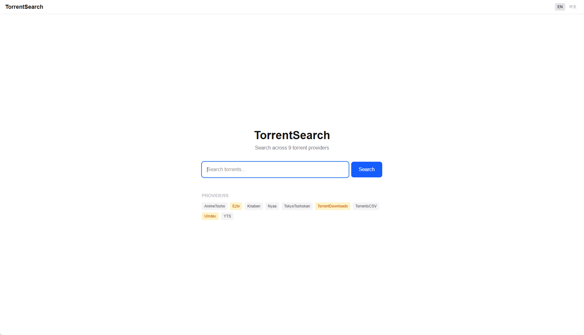
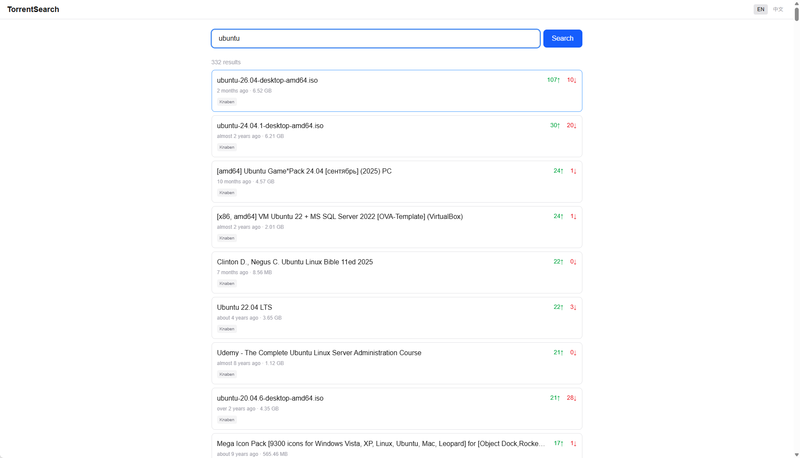
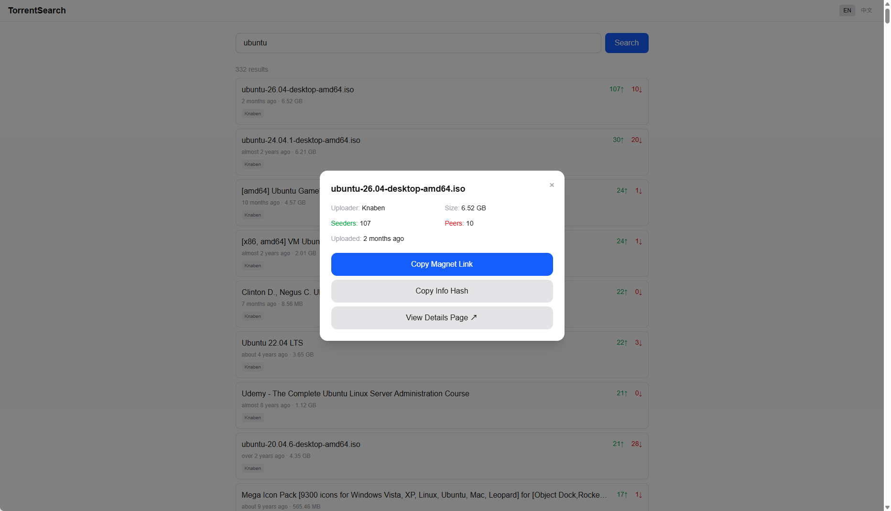

<p align="right">
  <a href="README.md">🇬🇧 English</a> | <a href="README.zh.md">🇨🇳 中文</a>
</p>

# TorrentNext

Aggregated torrent search across 43 providers. Built with Next.js + TailwindCSS + TypeScript.

## Screenshots

| Home | Search | Detail |
|---|---|---|
|  |  |  |

## Architecture

```
User → nginx:80 → Next.js (app):3000 → External torrent APIs/Pages
```

- **Next.js App Router** — API routes + frontend pages, single deployment
- **43 providers** — Torrent search parsers ported from Kotlin
- **nginx** — Reverse proxy, production entry point

## Quick Start

### Live Demo

Demo URL: **[https://OriginZero.github.io/NextTorrent/](https://OriginZero.github.io/NextTorrent/)**

> Statically exported and deployed to GitHub Pages via GitHub Actions.

### Development

```bash
npm install
npm run dev
# http://localhost:3000
```

### GitHub Actions Deployment (GitHub Pages)

Configured with `.github/workflows/deploy.yml`. Pushing to the `main` branch will automatically build and publish to GitHub Pages.

**Enable GitHub Pages for the first time:**
1. Navigate to repository `Settings` → `Pages`
2. Under `Build and deployment` > `Source`, select **GitHub Actions**
3. (Optional) To connect a custom external backend by default, add a Repository Secret under `Settings` → `Secrets and variables` → `Actions`: `NEXT_PUBLIC_API_URL` (e.g. `https://your-api.com`)

### Docker

```bash
docker compose up -d
# http://localhost
```

## API

| Endpoint | Description |
|----------|-------------|
| `GET /api/search?q=<query>` | Search torrents |
| `GET /api/torrent/details?url=<url>&provider=<name>` | Torrent details |
| `GET /api/torrent/latest?category=<cat>` | Latest torrents |
| `GET /api/torrent/top?category=<cat>` | Top torrents |
| `GET /api/providers` | Available providers |
| `GET /api/health` | Health check |

## Providers

43 providers in `src/lib/providers/`, each implements its own search logic. Some sites (Eztv, 1337x) are Cloudflare-protected — server-side fetch fails, use client-side browse.

## Language

English / Chinese, toggle in the top-right corner of the app.

---

## Disclaimer

TorrentNext does not host, store, or distribute any torrent files or copyrighted content. It searches publicly accessible third-party sources and displays the results. The developer is not responsible for how those results are accessed or used.

## License

[](LICENSE)

This project is licensed under the GNU General Public License v3.0.

## Acknowledgments

The 43 torrent parsers in this project are ported from [prajwalch/TorrentSearch](https://github.com/prajwalch/TorrentSearch) — an excellent open-source Android torrent search app. Thanks to the original author for the great work.
